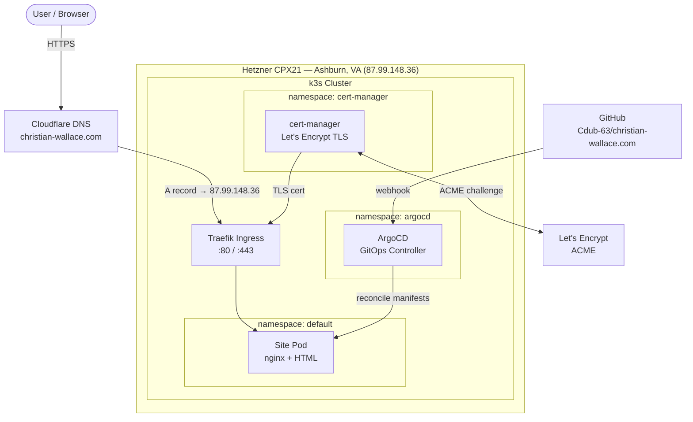

# christian-wallace.com

Personal portfolio and Kubernetes homelab. Resume, blog, and more — deployed via GitOps on a self-managed k3s cluster.

## Tech Stack

| Layer | Tool | Purpose |
|---|---|---|
| **DNS** | Cloudflare | Domain management, proxying |
| **Infrastructure** | Terraform + Hetzner | Server provisioning as code |
| **Kubernetes** | k3s | Lightweight single-node cluster |
| **Ingress** | Traefik | HTTP/HTTPS routing (k3s built-in) |
| **Package manager** | Helm | Install and upgrade cluster apps (cert-manager, ArgoCD) |
| **TLS** | cert-manager + Let's Encrypt | Automatic certificate management |
| **GitOps** | ArgoCD | Declarative, Git-driven deployments |
| **CI/CD** | GitHub Actions | Build and push on merge to main |
| **Observability** | Prometheus + Grafana | Metrics and dashboards (Month 2) |

## Infrastructure Diagram



## How Each Tool Earns Its Place

Every tool here replaces something painful. This is what the stack looks like without it:

**Without Terraform:**
You SSH into Hetzner's dashboard, click through a web UI to create a server, manually set firewall rules, and hope you remember what you did if you ever need to rebuild. With Terraform, the server, firewall, and SSH key are code — `terraform apply` rebuilds the exact same thing from scratch in 30 seconds.

**Without Cloudflare DNS-as-code:**
You log into the Cloudflare dashboard and manually type in the IP address. If you ever reprovision the server and get a new IP, you have to remember to go update it. With Terraform managing the DNS record, `terraform apply` updates the A record automatically whenever the server IP changes.

**Without cert-manager:**
You go to Let's Encrypt, prove you own the domain by manually placing a file on your server, download the certificate files, upload them to Kubernetes as a Secret, configure Traefik to use them, and set a calendar reminder to repeat all of this in 90 days when they expire. With cert-manager, you annotate an Ingress with `cert-manager.io/cluster-issuer: letsencrypt-prod` and it handles the proof, the issuance, the Secret, and the renewal — forever.

**Without Traefik (ingress):**
Every service you run needs its own public port (`:3000`, `:8080`, etc.) and you manage routing yourself. With Traefik, all traffic comes in on `:443` and it routes to the right service based on the hostname — `christian-wallace.com` goes to the site, `argocd.christian-wallace.com` goes to ArgoCD, all on the same IP.

**Without Helm:**
Installing cert-manager without Helm means finding the right GitHub release, downloading a single massive YAML file (~1,000 lines), applying it with `kubectl apply -f`, and hoping the defaults work for you. Want to change a setting (more replicas, different log level, resource limits)? You edit a file you don't own, which gets overwritten next time you upgrade. Upgrading means downloading a new YAML file and re-applying it — there's no record of what changed or what version you're on. With Helm, `helm install` tracks the version and your overrides, `helm upgrade` diffs cleanly, and `helm rollback` undoes it in one command.

**Without ArgoCD:**
Deploying a change means SSHing into the server, or running `kubectl apply` from your laptop with the right kubeconfig. If you change something manually and it breaks, there's no easy rollback and no record of what changed. With ArgoCD, the cluster watches your GitHub repo — push a commit, the cluster reconciles itself to match. Rollback is `git revert`.

## Repository Layout

```
christian-wallace.com/
├── terraform/          # Hetzner server + firewall provisioning
│   ├── main.tf
│   ├── variables.tf
│   └── outputs.tf
├── manifests/          # Kubernetes manifests (ArgoCD-managed)
│   ├── argocd/
│   ├── cert-manager/
│   └── site/
├── site/               # HTML/CSS source for the website
└── .github/workflows/  # CI/CD (coming Month 2)
```

## Local Setup

**Prerequisites:** `kubectl`, `helm`, `terraform`, `k9s`, `hcloud`

```bash
# Clone
git clone git@github.com:Cdub-63/christian-wallace.com.git
cd christian-wallace.com

# Add secrets (gitignored)
echo 'hcloud_token = "..."' > terraform/terraform.tfvars.local

# Provision infrastructure
cd terraform
terraform init
terraform apply -var-file="terraform.tfvars.local"

# View cluster
kubectl get pods -A
k9s
```

