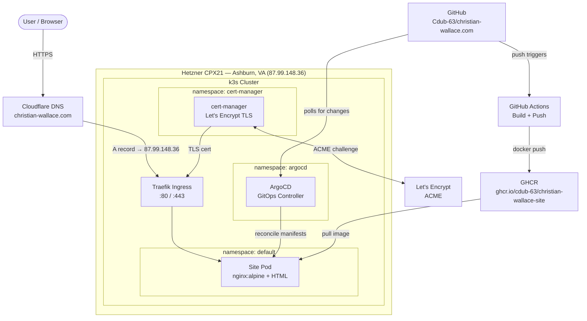

# christian-wallace.com

Personal portfolio and Kubernetes homelab. Resume, blog, and more — deployed via GitOps on a self-managed k3s cluster.

## Tech Stack

| Layer | Tool | Purpose |
|---|---|---|
| **DNS** | Cloudflare | Domain management, proxying |
| **Infrastructure** | Terraform + Hetzner | Server provisioning as code |
| **Kubernetes** | k3s | Lightweight single-node cluster |
| **Ingress** | Traefik | HTTP/HTTPS routing (k3s built-in) |
| **Package manager** | Helm | Install and upgrade cluster apps (cert-manager, ArgoCD) |
| **TLS** | cert-manager + Let's Encrypt | Automatic certificate management |
| **GitOps** | ArgoCD | Declarative, Git-driven deployments |
| **CI/CD** | GitHub Actions | Build and push image on changes to site or Dockerfile |
| **Container image** | Docker + nginx:alpine | HTML files baked into image at build time |
| **Container registry** | GHCR | Stores versioned Docker images alongside the repo |
| **Observability** | Prometheus + Grafana | Metrics and dashboards (Month 2) |
| **Grafana storage** | Kubernetes PVC (local-path, 1Gi) | Persists Grafana's SQLite DB across pod restarts |
| **Uptime monitoring** | UptimeRobot | External uptime checks with email alerts |

## Infrastructure Diagram



## How Each Tool Earns Its Place

Every tool here replaces something painful. This is what the stack looks like without it:

**Without Terraform:**
You SSH into Hetzner's dashboard, click through a web UI to create a server, manually set firewall rules, and hope you remember what you did if you ever need to rebuild. With Terraform, the server, firewall, and SSH key are code — `terraform apply` rebuilds the exact same thing from scratch in 30 seconds.

**Without Cloudflare DNS-as-code:**
You log into the Cloudflare dashboard and manually type in the IP address. If you ever reprovision the server and get a new IP, you have to remember to go update it. With Terraform managing the DNS record, `terraform apply` updates the A record automatically whenever the server IP changes.

**Without cert-manager:**
You go to Let's Encrypt, prove you own the domain by manually placing a file on your server, download the certificate files, upload them to Kubernetes as a Secret, configure Traefik to use them, and set a calendar reminder to repeat all of this in 90 days when they expire. With cert-manager, you annotate an Ingress with `cert-manager.io/cluster-issuer: letsencrypt-prod` and it handles the proof, the issuance, the Secret, and the renewal — forever.

**Without Traefik (ingress):**
Every service you run needs its own public port (`:3000`, `:8080`, etc.) and you manage routing yourself. With Traefik, all traffic comes in on `:443` and it routes to the right service based on the hostname — `christian-wallace.com` goes to the site, `argocd.christian-wallace.com` goes to ArgoCD, all on the same IP.

**Without Helm:**
Installing cert-manager without Helm means finding the right GitHub release, downloading a single massive YAML file (~1,000 lines), applying it with `kubectl apply -f`, and hoping the defaults work for you. Want to change a setting (more replicas, different log level, resource limits)? You edit a file you don't own, which gets overwritten next time you upgrade. Upgrading means downloading a new YAML file and re-applying it — there's no record of what changed or what version you're on. With Helm, `helm install` tracks the version and your overrides, `helm upgrade` diffs cleanly, and `helm rollback` undoes it in one command.

**Without ArgoCD:**
Deploying a change means SSHing into the server, or running `kubectl apply` from your laptop with the right kubeconfig. If you change something manually and it breaks, there's no easy rollback and no record of what changed. With ArgoCD, the cluster watches your GitHub repo — push a commit, the cluster reconciles itself to match. Rollback is `git revert`.

**Without Docker + GitHub Actions:**
Updating the site meant cramming all the HTML into a Kubernetes ConfigMap (a 600-line YAML file), committing that generated file, and pushing. With a Dockerfile, the HTML is baked into a self-contained image at build time. GitHub Actions builds and pushes that image to GHCR automatically on every push — no manual steps, no generated files in version control.

## Repository Layout

```
christian-wallace.com/
├── Dockerfile          # nginx:alpine image with site/ baked in
├── terraform/          # Hetzner server + firewall provisioning
│   ├── main.tf
│   ├── variables.tf
│   └── outputs.tf
├── manifests/          # Kubernetes manifests (ArgoCD-managed)
│   ├── argocd/
│   ├── cert-manager/
│   └── site/
├── site/               # HTML/CSS source for the website
└── .github/workflows/  # GitHub Actions — build + push to GHCR
```

## Local Setup

**Prerequisites:** `kubectl`, `helm`, `terraform`, `k9s`, `hcloud`

```bash
# Clone
git clone git@github.com:Cdub-63/christian-wallace.com.git
cd christian-wallace.com

# Add secrets (gitignored)
echo 'hcloud_token = "..."' > terraform/terraform.tfvars.local

# Provision infrastructure
cd terraform
terraform init
terraform apply -var-file="terraform.tfvars.local"

# View cluster
kubectl get pods -A
k9s
```

## Challenges & Lessons Learned

Real issues hit during the build, documented here because they're the kind of thing tutorials skip.

### ArgoCD autosync doesn't redeploy on new images

ArgoCD syncs what's in Git — if the manifest hasn't changed, it does nothing. After wiring up the CI pipeline to build and push a new Docker image on every push, the site pods weren't updating. ArgoCD reported "Synced" because the deployment manifest in Git still had the old image tag.

**Fix:** Added a `sed` step at the end of the GitHub Actions workflow to rewrite the image tag in `manifests/site/deployment.yaml` and commit it back. ArgoCD detects the Git change, syncs, and rolls out the new pod. The CI commit is what drives the deploy, not the image push.

### Running nginx as non-root requires more than just a securityContext

Setting `runAsNonRoot: true` on the pod is only the start. nginx:alpine's default config binds to port 80, which requires root — the pod will crash on startup. And `readOnlyRootFilesystem: true` breaks nginx's assumptions about where it can write: the PID file goes to `/var/run/nginx.pid` and temp files land in `/var/cache/nginx`, both on the root filesystem.

**Fix:** Three changes together make it work. First, a custom `nginx.conf` that moves the PID file to `/tmp/nginx.pid` and redirects all five temp path directives (`client_body_temp_path`, `proxy_temp_path`, etc.) to `/tmp`. Second, a custom `default.conf` that listens on `8080` instead of `80`. Third, two `emptyDir` volumes mounted at `/var/cache/nginx` and `/tmp` so those paths are writable at runtime. The Service `targetPort` and NetworkPolicy ingress port also need updating to `8080` — updating the pod port without touching those leaves traffic silently dead.

### Grafana password silently rotated on every ArgoCD sync

After installing kube-prometheus-stack, Grafana login stopped working after the next ArgoCD sync. The chart generates a random admin password on install and stores it in a Secret. On upgrades it uses Helm's `lookup` function to reuse the existing value — but ArgoCD renders Helm templates offline (`helm template`), so `lookup` always returns nothing and a new random password is written to the Secret on every sync. Grafana's SQLite DB still had the old password. They drifted silently, login broke.

**Fix:** Add `grafana.admin.existingSecret` in the ArgoCD Helm values pointing to the auto-created secret by name. This tells Helm to leave the secret alone — no more rotation on sync. Set the password once with `grafana cli admin reset-admin-password`, patch the secret to match, and it stays in sync permanently. Pin `targetRevision` to a specific chart version so you control when upgrades happen rather than auto-upgrading to latest on every sync.

### kube-prometheus-stack OOM'd the node

Installing `kube-prometheus-stack` (Prometheus + Grafana + Alertmanager + exporters) on a Hetzner CPX21 (3 vCPU, 4 GB RAM) killed the node. k3s itself was already consuming ~1.8 GB, leaving barely 2 GB for everything else. On startup, Prometheus alone spiked past what was available, the node hit 52 MB free, the embedded SQLite database started timing out on every query, and the API server became unreachable.

**Fix:** Upgraded the node to CPX31 (4 vCPU, 8 GB RAM) via a one-line change to `server_type` in Terraform. Hetzner resizes in-place — same IP, data preserved, ~90 seconds of downtime.

