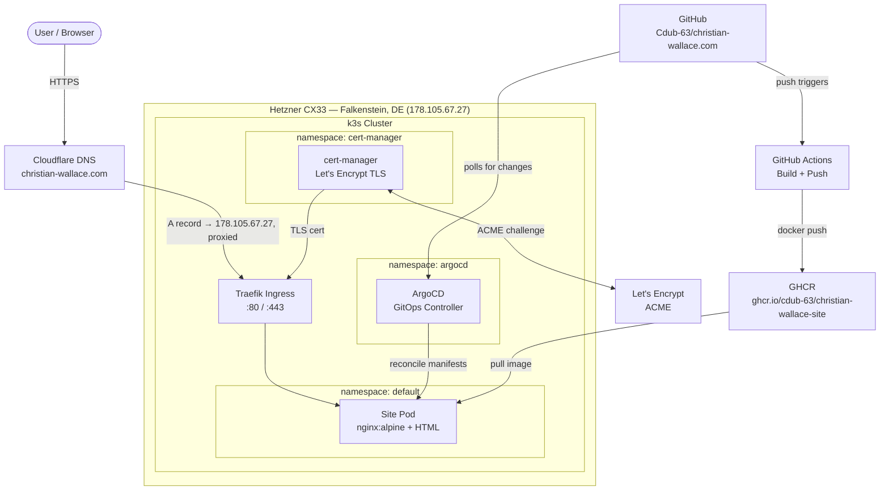

# christian-wallace.com

Personal portfolio and Kubernetes homelab. Resume, blog, and more — deployed via GitOps on a self-managed k3s cluster.

## Tech Stack

| Layer | Tool | Purpose |
|---|---|---|
| **DNS** | Cloudflare | Domain management, proxying |
| **Infrastructure** | Terraform + Hetzner | Server provisioning as code |
| **Kubernetes** | k3s | Lightweight single-node cluster |
| **Ingress** | Traefik | HTTP/HTTPS routing (k3s built-in) |
| **Package manager** | Helm | Install and upgrade cluster apps (cert-manager, ArgoCD) |
| **TLS** | cert-manager + Let's Encrypt | Automatic certificate management |
| **GitOps** | ArgoCD | Declarative, Git-driven deployments |
| **GitOps (app-of-apps)** | ArgoCD root Application | Watches `manifests/argocd/` so Application manifest changes deploy automatically on push |
| **CI/CD** | GitHub Actions | Build and push image on changes to site or Dockerfile |
| **Container image** | Docker + nginx:alpine | HTML files baked into image at build time |
| **Container registry** | GHCR | Stores versioned Docker images alongside the repo |
| **CNI** | Cilium (eBPF) | Pod networking + NetworkPolicy enforcement; replaced Flannel which silently ignores NetworkPolicy |
| **Observability** | Prometheus + Grafana | Metrics and dashboards (Month 2) |
| **Grafana storage** | Kubernetes PVC (local-path, 1Gi) | Persists Grafana's SQLite DB across pod restarts |
| **Uptime monitoring** | UptimeRobot | External uptime checks with email alerts |

## Infrastructure Diagram


```mermaid
graph TB
    User([User / Browser])
    CF[Cloudflare DNS<br/>christian-wallace.com]
    GH[GitHub<br/>Cdub-63/christian-wallace.com]
    Actions[GitHub Actions<br/>Build + Push]
    GHCR[GHCR<br/>ghcr.io/cdub-63/christian-wallace-site]

    subgraph Hetzner ["Hetzner CX33 — Falkenstein, DE (178.105.67.27)"]
        subgraph k3s ["k3s Cluster"]
            Traefik[Traefik Ingress<br/>:80 / :443]

            subgraph argocd-ns ["namespace: argocd"]
                ArgoCD[ArgoCD<br/>GitOps Controller]
            end

            subgraph cert-ns ["namespace: cert-manager"]
                CertManager[cert-manager<br/>Let's Encrypt TLS]
            end

            subgraph site-ns ["namespace: default"]
                Site[Site Pod<br/>nginx:alpine + HTML]
            end
        end
    end

    LE[Let's Encrypt<br/>ACME]

    User -->|HTTPS| CF
    CF -->|A record → 178.105.67.27, proxied| Traefik
    Traefik --> Site
    GH -->|push triggers| Actions
    Actions -->|docker push| GHCR
    GH -->|polls for changes| ArgoCD
    ArgoCD -->|reconcile manifests| Site
    GHCR -->|pull image| Site
    CertManager <-->|ACME challenge| LE
    CertManager -->|TLS cert| Traefik
```

## How Each Tool Earns Its Place

Every tool here replaces something painful. This is what the stack looks like without it:

**Without Terraform:** Hetzner server, firewall, and SSH key would be manual console clicks with no record of what was done — `terraform apply` rebuilds all of it from scratch in 30 seconds.

**Without Cloudflare DNS-as-code:** Reprovisioning the server would mean remembering to manually update the A record with the new IP. Terraform updates it automatically on every apply.

**Without cert-manager:** TLS would mean manually proving domain ownership, downloading certs, uploading them as Kubernetes Secrets, and remembering to repeat it every 90 days. One annotation (`cert-manager.io/cluster-issuer: letsencrypt-prod`) automates issuance and renewal forever.

**Without Traefik:** Every service would need its own public port. Traefik routes all traffic on `:443` by hostname, so `christian-wallace.com` and `argocd.christian-wallace.com` share one IP.

**Without Helm:** Installing cert-manager would mean downloading a ~1,000-line YAML file, applying it blind, and losing any record of what version or overrides are in place. Helm tracks both, and `helm rollback` undoes a bad upgrade in one command.

**Without ArgoCD:** Deploying would mean SSHing in or running `kubectl apply` from a laptop, with no rollback and no record of what changed. ArgoCD reconciles the cluster to Git on every push; rollback is `git revert`.

**Without Docker + GitHub Actions:** Site updates would mean cramming HTML into a 600-line ConfigMap and committing the generated file. A Dockerfile bakes HTML into an image; Actions builds and pushes it to GHCR on every push.

## Repository Layout

```
christian-wallace.com/
├── Dockerfile          # nginx:alpine image with site/ baked in
├── terraform/          # Hetzner server + firewall provisioning
│   ├── main.tf
│   ├── variables.tf
│   └── outputs.tf
├── manifests/          # Kubernetes manifests (ArgoCD-managed)
│   ├── argocd/
│   ├── cert-manager/
│   └── site/
├── site/               # HTML/CSS source for the website
└── .github/workflows/  # GitHub Actions — build + push to GHCR
```

## Local Setup

**Prerequisites:** `kubectl`, `helm`, `terraform`, `k9s`, `hcloud`

```bash
# Clone
git clone git@github.com:Cdub-63/christian-wallace.com.git
cd christian-wallace.com

# Add secrets (gitignored)
echo 'hcloud_token = "..."' > terraform/terraform.tfvars.local

# Provision infrastructure
cd terraform
terraform init
terraform apply -var-file="terraform.tfvars.local"

# View cluster
kubectl get pods -A
k9s
```

## Challenges & Lessons Learned

Real issues hit during the build, documented here because they're the kind of thing tutorials skip.

### ArgoCD autosync doesn't redeploy on new images

ArgoCD syncs what's in Git, not what's in the registry — after wiring up CI to push a new image on every commit, pods stopped updating because the deployment manifest still had the old tag, and ArgoCD reported "Synced" anyway.

**Fix:** A `sed` step at the end of the GitHub Actions workflow rewrites the image tag in `manifests/site/deployment.yaml` and commits it back. The CI commit drives the deploy, not the image push.

### Running nginx as non-root requires more than just a securityContext

Setting `runAsNonRoot: true` is only the start. nginx:alpine's default config binds to port 80, which needs root, and `readOnlyRootFilesystem: true` breaks its PID file and temp paths on the root filesystem.

**Fix:** A custom `nginx.conf` moves the PID file and all five temp-path directives to `/tmp`; a custom `default.conf` listens on `8080` instead of `80`; and two `emptyDir` volumes make `/var/cache/nginx` and `/tmp` writable. The Service `targetPort` and NetworkPolicy port must move to `8080` too — missing either leaves traffic silently dead.

### Grafana password silently rotated on every ArgoCD sync

The chart generates a random admin password on install and reuses it on upgrade via Helm's `lookup` function — but ArgoCD renders charts offline (`helm template`), so `lookup` always returns nothing and a new random password lands in the Secret on every sync while Grafana's SQLite DB keeps the old one. Login broke silently.

**Fix:** Create the secret *outside* Helm (`kubectl create secret generic grafana-admin-creds -n monitoring --from-literal=admin-user=admin --from-literal=admin-password=<pw>`) and point `grafana.admin.existingSecret` at it — the chart's own auto-created secret (`kube-prometheus-stack-grafana`) still gets re-rendered every sync, so it has to be a secret ArgoCD doesn't own. Also enable `grafana.persistence` (PVC) so the SQLite DB survives restarts instead of re-initializing from a stale secret. To recover after drift: `grafana cli admin reset-admin-password <pw>` inside the pod.

### Flannel silently ignores NetworkPolicy

Applying a NetworkPolicy with Flannel (k3s's default CNI) does nothing — Flannel routes pods but never enforces policy, and the API server accepts the manifest with no error or warning. Traffic just flows as if it doesn't exist.

**Fix:** Replace Flannel with Cilium (eBPF-based, O(1) kernel hash maps instead of iptables chains, plus Hubble for flow observability). On a live cluster: set `flannel-backend: none` and `disable-network-policy: true` in `/etc/rancher/k3s/config.yaml`, restart k3s, delete the stale `flannel.1` interface, `helm install` Cilium (`operator.replicas=1`), then cycle every pod to pick up new network interfaces. Cilium is a bootstrap dependency — it needs one manual `helm install` before ArgoCD exists; after that, `manifests/argocd/app-cilium.yaml` manages upgrades.

### ArgoCD doesn't manage its own Application manifests

ArgoCD manages whatever its Application resources *point at*, but the Application resources themselves are just regular Kubernetes objects — editing `app-monitoring.yaml` in Git does nothing until something applies it to the cluster. This caused three days of Grafana login failures: the password-rotation and PVC fixes were committed, but the live Application resource still had the old values, so ArgoCD kept syncing the chart correctly with the wrong config.

**Fix:** App-of-apps. A root Application (`manifests/argocd/root-app.yaml`) watches `manifests/argocd/` and applies everything in it, so changes to Application manifests go live on push too. Bootstrapped once via `kubectl apply -f manifests/argocd/root-app.yaml`; after that, git is the only control plane.

### Replacing the CNI leaves surviving pods with broken networking

When Cilium replaced Flannel, already-running pods kept their old network namespace and eBPF state, so they crash-looped instead of recovering — Prometheus couldn't reach the API ClusterIP and kept failing its startup probe. A fresh debug pod in the same namespace worked fine, confirming the problem was stale state on the long-lived pods, not the network itself.

**Fix:** Delete all running pods after any CNI swap so they restart with a fresh namespace and clean Cilium endpoint entries — crash-loop restarts alone don't trigger namespace recreation, only a full delete does.

### The pod recycle sweep after that fix was still incomplete

Ten days after the Cilium cutover, ArgoCD's sync status was stuck on `Unknown`. Cause: `argocd-application-controller-0`, a StatefulSet pod never recycled during the cutover, still held a stale Flannel IP and couldn't resolve `argocd-repo-server` via CoreDNS. A sweep for pods still on the old `10.42.0.0/16` CIDR turned up three more stragglers that never crash-looped loudly enough to notice: `metrics-server` (silently `0/1`), `local-path-provisioner`, and the `svclb-traefik` DaemonSet pod.

The lesson isn't "avoid CNI-swap downtime" — on a single-node cluster there's no second node to shift load to, so some downtime during cutover is unavoidable. Multi-node clusters just stagger the same requirement via cordon-and-drain instead of eating it all at once; every pod's namespace still has to be destroyed and recreated either way.

**Fix:** Make the recycle sweep mechanical, not memory-based. Immediately after the new CNI is ready, recycle every Deployment/DaemonSet/StatefulSet in every namespace in one pass (`kubectl delete pods --all -A`) instead of only the pods that are visibly broken — a pod can sit quietly wired to the old CNI for weeks without crash-looping.

### kube-prometheus-stack OOM'd the node

Installing `kube-prometheus-stack` on a Hetzner CPX21 (4GB RAM) killed the node — k3s alone already used ~1.8GB, and Prometheus's startup spike pushed free memory to 52MB, timing out its own SQLite database and making the API server unreachable.

**Fix:** Upgraded to CPX31 (8GB) via a one-line `server_type` change in Terraform — Hetzner resizes in-place, same IP, data preserved, ~90 seconds of downtime.

### Hetzner's June 2026 price hike only hit the US region, and only the old server line

The bill jumped from ~$37 to $73.49 with no size change. Cause: Hetzner rolled out a cheaper server generation (CX23–CX53, CAX ARM) in June 2026, but only in its European datacenters — Ashburn and Hillsboro never got it, and the old CPX line was deprecated everywhere *except* those two US locations, where it stayed on sale at sharply inflated pricing instead. `hcloud server-type describe cpx31` shows the identical 4-core/8GB spec at $20.49/mo in Falkenstein vs. $73.49/mo in Ashburn — a 3.6x markup just for hosting in the US.

**Fix:** Migrated to a `cx33` in Falkenstein — $8.99/mo, an 88% cut. `hcloud server-type list` confirmed CX/CAX don't exist as options in `ash`/`hil`, and downsizing within CPX/CCX there had no path below ~$51/mo. This crossed regions, so unlike the earlier CPX21→CPX31 resize, no in-place upgrade was possible — it meant a full rebuild: new server, k3s with Cilium as the CNI from first boot (no Flannel-migration dance this time), cert-manager + ArgoCD reinstalled via Helm, `grafana-admin-creds` recreated, then `root-app.yaml` applied to let ArgoCD pull everything back in from Git. Cut over by repointing the four Cloudflare A records; certs re-issued automatically once DNS propagated. The old server stayed up until the new one was verified healthy end-to-end.

Also flipped root and `www` to Cloudflare-proxied (`proxied = true`) — the origin moved from Virginia to Germany, so routing US visitors through Cloudflare's edge offsets the added latency. `argocd`/`grafana` stayed DNS-only since proxying admin tools adds no benefit.

### Traefik metrics were generated but never scraped

Traefik already had Prometheus metrics enabled internally (`--metrics.prometheus=true`, a `metrics` containerPort exposed) — but nothing was collecting it. No ServiceMonitor or PodMonitor existed, so Prometheus had zero targets despite the data being available the whole time.

**Fix:** Added a `PodMonitor` selecting Traefik's `metrics` port, labeled `release: kube-prometheus-stack` to match the chart's selector, synced via a new `app-observability.yaml` Application — no changes to the k3s-managed Traefik resources, so it can't be clobbered by k3s's own reconciliation. Gives request counts (`traefik_router_requests_total`) only, not unique visitors — Traefik has no concept of a session.

