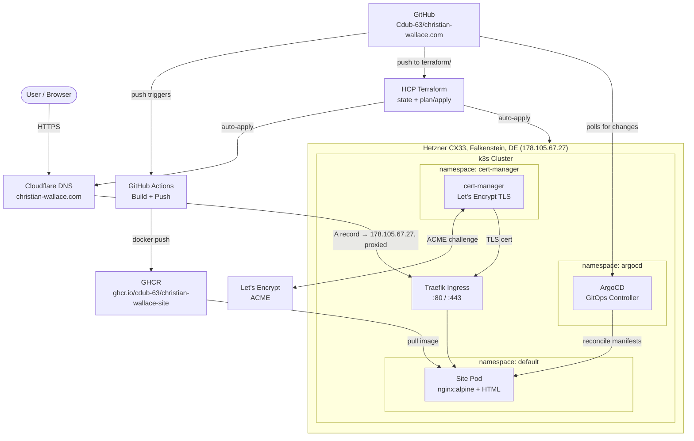

# christian-wallace.com

Personal portfolio and Kubernetes homelab. Resume, blog, and more, deployed via GitOps on a self-managed k3s cluster.

- [How each tool earns its place](docs/why-each-tool.md): what the stack would look like without each piece
- [Challenges & lessons learned](docs/lessons-learned.md): real issues hit during the build and how they were fixed

## Infrastructure Diagram


```mermaid
graph TB
    User([User / Browser])
    CF[Cloudflare DNS<br/>christian-wallace.com]
    GH[GitHub<br/>Cdub-63/christian-wallace.com]
    Actions[GitHub Actions<br/>Build + Push]
    GHCR[GHCR<br/>ghcr.io/cdub-63/christian-wallace-site]
    HCP[HCP Terraform<br/>state + plan/apply]

    subgraph Hetzner ["Hetzner CX33, Falkenstein, DE (178.105.67.27)"]
        subgraph k3s ["k3s Cluster"]
            Traefik[Traefik Ingress<br/>:80 / :443]

            subgraph argocd-ns ["namespace: argocd"]
                ArgoCD[ArgoCD<br/>GitOps Controller]
            end

            subgraph cert-ns ["namespace: cert-manager"]
                CertManager[cert-manager<br/>Let's Encrypt TLS]
            end

            subgraph site-ns ["namespace: default"]
                Site[Site Pod<br/>nginx:alpine + HTML]
            end
        end
    end

    LE[Let's Encrypt<br/>ACME]

    User -->|HTTPS| CF
    CF -->|A record → 178.105.67.27, proxied| Traefik
    Traefik --> Site
    GH -->|push triggers| Actions
    GH -->|push to terraform/| HCP
    HCP -->|auto-apply| Hetzner
    HCP -->|auto-apply| CF
    Actions -->|docker push| GHCR
    GH -->|polls for changes| ArgoCD
    ArgoCD -->|reconcile manifests| Site
    GHCR -->|pull image| Site
    CertManager <-->|ACME challenge| LE
    CertManager -->|TLS cert| Traefik
```

## Repository Layout

```
christian-wallace.com/
├── Dockerfile          # nginx:alpine image with site/ baked in
├── docs/               # Why each tool is here, lessons learned
├── terraform/          # Hetzner + Cloudflare, applied by HCP Terraform on push
│   ├── main.tf
│   ├── variables.tf
│   ├── outputs.tf
│   ├── cloud-init.yaml     # First-boot bootstrap: k3s, Cilium, ArgoCD, root app
│   ├── ssh_key.pub         # Public key for the server (read by remote runs)
│   └── .terraform.lock.hcl # Pinned provider versions
├── k3s/
│   ├── config.yaml         # Node-level k3s flags (/etc/rancher/k3s/config.yaml), written by cloud-init
│   ├── cilium-values.yaml  # Cilium Helm values, shared by cloud-init and ArgoCD
│   └── argocd-values.yaml  # ArgoCD Helm values, shared by cloud-init and ArgoCD (which manages itself)
├── manifests/          # Kubernetes manifests (ArgoCD-managed)
│   ├── argocd/
│   ├── cert-manager/
│   └── site/
├── site/               # HTML/CSS source for the website
└── .github/workflows/  # GitHub Actions: build + push to GHCR
```

## Tech Stack

| Layer | Tool | Purpose |
|---|---|---|
| **DNS** | Cloudflare | Domain management, proxying |
| **Infrastructure** | Terraform + Hetzner | Server, firewall, SSH key, and DNS records as code |
| **Infra GitOps** | HCP Terraform (VCS-driven) | Remote state with locking and history; a push touching `terraform/` plans and auto-applies, the Terraform equivalent of ArgoCD |
| **Kubernetes** | k3s | Lightweight single-node cluster |
| **Ingress** | Traefik | HTTP/HTTPS routing (k3s built-in) |
| **Package manager** | Helm | Install and upgrade cluster apps (cert-manager, ArgoCD) |
| **TLS** | cert-manager + Let's Encrypt | Automatic certificate management |
| **GitOps** | ArgoCD (app-of-apps) | Declarative, Git-driven deployments; a root Application watches `manifests/argocd/` so Application manifest changes deploy automatically on push |
| **CI/CD** | GitHub Actions | Build and push image on changes to site or Dockerfile |
| **Container image** | Docker + nginx:alpine | HTML files baked into image at build time |
| **Container registry** | GHCR | Stores versioned Docker images alongside the repo |
| **CNI** | Cilium (eBPF) | Pod networking, NetworkPolicy enforcement, and Service load balancing (replaces kube-proxy); replaced Flannel which silently ignores NetworkPolicy |
| **Observability** | Prometheus + Grafana | Metrics and dashboards |
| **Grafana storage** | Kubernetes PVC (local-path, 1Gi) | Persists Grafana's SQLite DB across pod restarts |
| **Uptime monitoring** | UptimeRobot | External uptime checks with email alerts |
| **Alerting** | Alertmanager + Discord | Routes Prometheus alerts (including memory-near-limit and OOMKill rules) to a Discord channel |
| **Dead man's switch** | healthchecks.io | Alertmanager pings it every minute via the always-firing `Watchdog` alert; if pings stop for ~10 minutes, it posts to Discord |
